# 相比[原版blivechat](https://github.com/xfgryujk/blivechat)新增的功能

### 特别感谢（排名不分先后）：椅子_Official，海式policturn，小川尚未，梅林Kitsune，因扎因·内比娅，玲玲

## **首页-常规**——参数说明

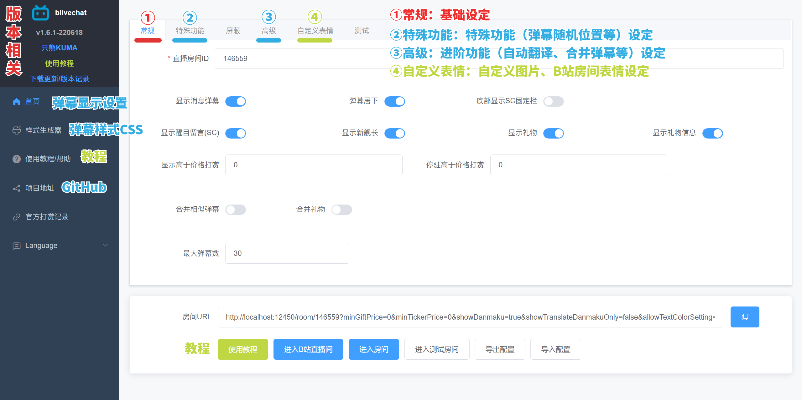 

### 1.基础弹幕设置
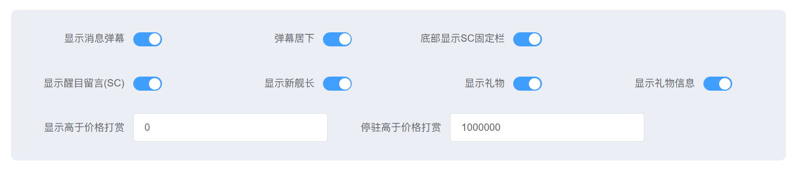

#### 弹幕类型
1. 普通弹幕(Message)
2. 醒目留言 Super Chat (SC)
3. 上舰信息(Member)
4. 礼物信息(Gift)

#### 弹幕显示方式
1. 弹幕居下——弹幕从下方出现
2. 底部显示SC打赏固定栏(ticker)——将打赏固定栏置于底部
#### 最低显示打赏价格（RMB/CNY/元）

1. 显示高于价格打赏（元） —— 只显示超过改价格的打赏（礼物、上舰等）

2. 最低顶部停驻打赏价格（元） —— 只在打赏固定栏显示超过改价格的打赏（礼物、上舰等）
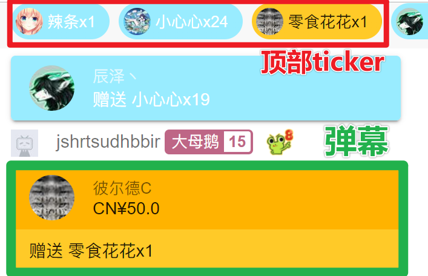

精确到小数点后1位，区分银瓜子，金瓜子礼物

- `银瓜子礼物`：价格为 `0元`
- `金瓜子礼物`：根据B站设定，最低为 `0.1元`

设置为 0.1, 则只显示金瓜子礼物, 不显示银瓜子礼物
### 2.合并弹幕相关

1. 合并相似弹幕——开启后合并相似内容相似的弹幕（并记录出现次数）
2. 合并礼物——开启后合并同一用户送的多个相同礼物
3. 合并同用户的连续弹幕——开启后同一用户在时间间隔内发送的弹幕会被合并渲染（在HTML）
4. 合并同用户的连续弹幕的最大时间间隔（秒）——开启后该【秒】数内同用户发送的弹幕会被合并

### 3.弹幕数量设置
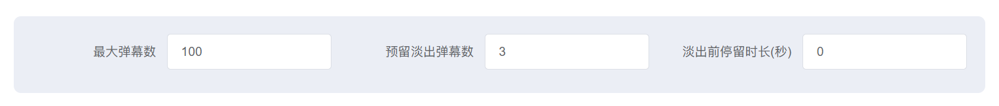
1. 最大弹幕数量——浏览器源显示的最大弹幕数量
2. 预留淡出弹幕数——预留给弹幕消失动画，避免在动画过程中弹幕被删除的预留用弹幕数量
3. 淡出前停留时长(秒)——默认0为持续停留，弹幕将会在设置秒数后触发淡出
## **首页-特殊功能**——参数说明

### 1.用户自定义弹幕颜色

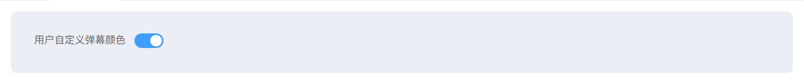 

观众可以发送 #Hex 色号指定自己的弹幕颜色（用于歌回应援色等）

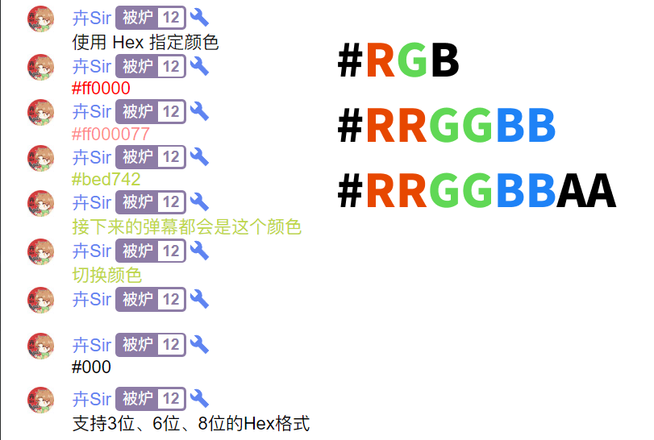 

### 2.屏蔽/单独显示翻译弹幕
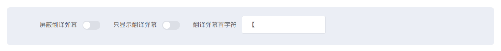 
1. 单独显示翻译弹幕——开启后非翻译弹幕均不显示
2. 屏蔽翻译弹幕——开启后屏蔽翻译弹幕
3. 翻译弹幕首字符——以弹幕第一个字符判定是否为翻译弹幕

### 3.随机弹幕位置
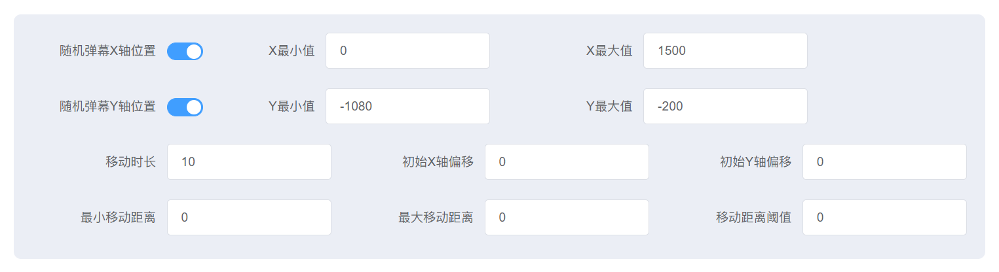 
以下的距离单位均为 `px`, 时间单位均为 `sec(秒)`
1. 随机X轴位置(X最小值、X最大值)——弹幕出现的X轴位置将会在(最小值，最大值)间浮动
	- 最小值最大值可为正/负数(控制方向：X向左为负，向右为正)
2. 随机Y轴位置(Y最小值、Y最大值)——弹幕出现的Y轴位置将会在(最小值，最大值)间浮动
	- 最小值最大值可为正/负数(控制方向：Y向下为正，向上为负)

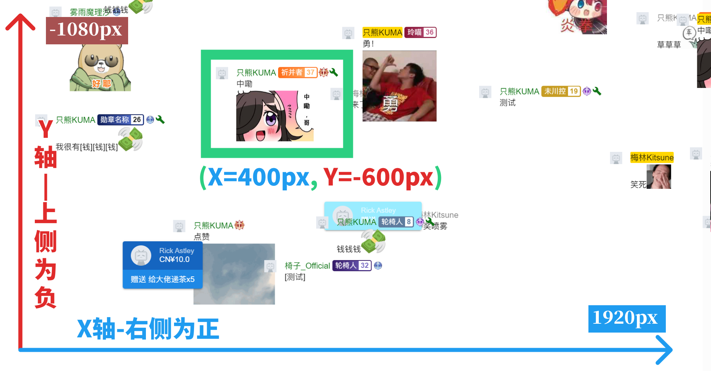 

3. 停留时长(漂浮时长)——弹幕移动耗时(1000px耗时10秒——每秒100px)
4. 初始X/Y偏移——弹幕出现时的基础偏移位置(默认在左下角(左下角为(0,0))
5. 最小、最大X移动距离——弹幕移动的距离将在X轴水平方向(最小X移动距离，最大X移动距离)之内随机，让有的弹幕飘得远，有的飘得近
6. 最小、最大Y移动距离——弹幕移动的距离将在Y轴竖直方向(最小Y移动距离，最大Y移动距离)之内随机，让有的弹幕飘得远，有的飘得近
7. 移动距离阈值——如果原本的范围是 (-1000, 1000)，设置移动距离阈值为200时，范围变为(-1000, -200)∪(200, 1000)。目的是当最小最大移动距离横跨正负值的时候，避免随机到的距离过小导致弹幕不移动。
    

适用于有实时翻译man在直播间的V，可以开2个【浏览器源】分离以翻译弹幕

## **首页-自定义表情**——参数说明

### 1.自定义表情相关功能

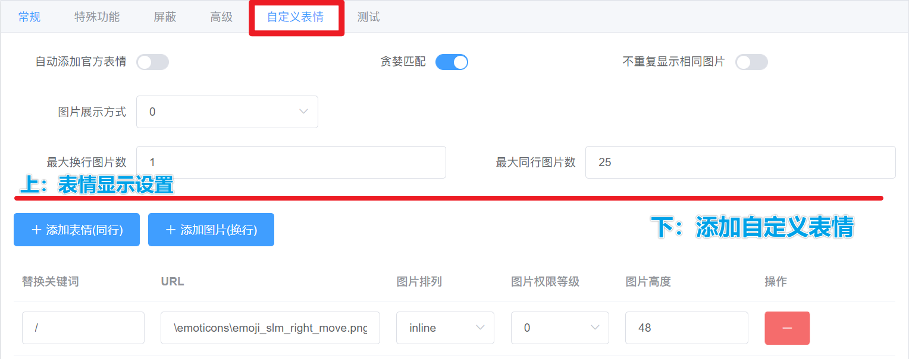 

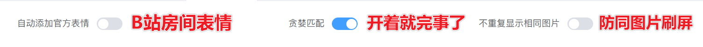 
#### `自动添加官方表情` 
开启后：包含B站直播间通用表情，主播设置的B站表情（无需自己添加设定）——但不能自定义（图片高度等）

#### `贪婪匹配（表情包匹配逻辑）`——可以跳过
1. 贪婪匹配（匹配最长的字串）
	从左到右阅读：关键词，在关键词基础上的匹配逻辑，匹配结果
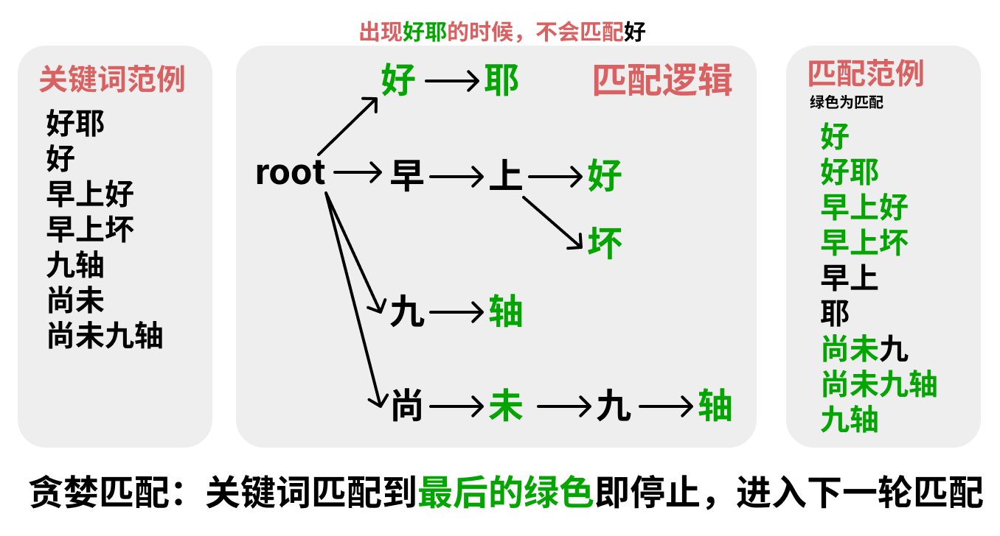 

2. 非贪婪匹配（匹配最短的字串）
	从左到右阅读：关键词，在关键词基础上的匹配逻辑，匹配结果
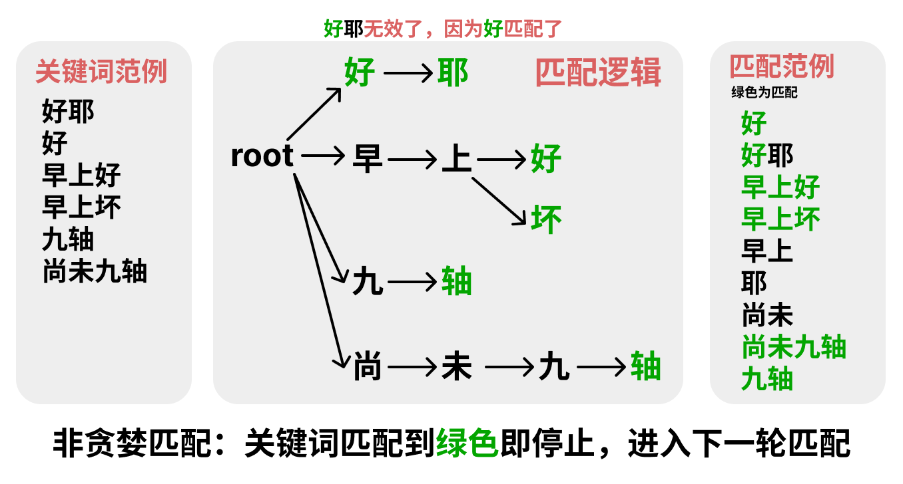 

#### `不重复显示相同图片`

一条弹幕中，一个表情包/图片指出现一次
#### `图片展示方式` 
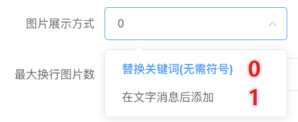 
1. 替换表情包（无需符号）—— `0`

	逐个替换【关键词】为图片插入在弹幕消息文字**中**(在不超过最大图片数，满足调用权限（舰长以上）的情况下）

2. 在文字消息后添加—— `1`
	
	将所有【关键词】转为图片添加在弹幕消息**后面**(在不超过最大图片数，满足调用权限（舰长以上）的情况下）

#### `最大图片数` 
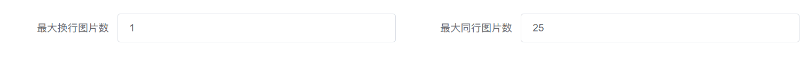 
1. 最大**换行**图片数

	即弹幕关键词转换为【换行】图片的最大数量（防止大量关键词出现时，图片刷屏）—— 默认为1，设置为0则屏蔽表情

2. 最大**同行**图片数

	即弹幕关键词转换为【同行】图片的最大数量（防止大量关键词出现时，图片刷屏）—— 默认为5，设置为0则屏蔽表情

### 2. 表情包添加、配置教程

#### 首先表情包需存放于： `blivechat/data/emoticon` 并使用【**英文命名**】

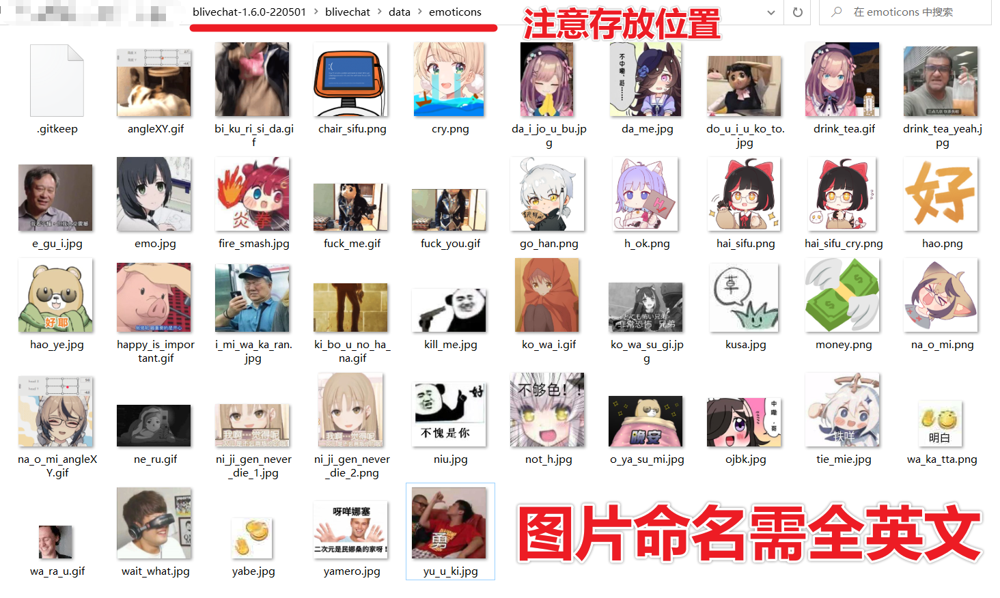 

在网页前端的【首页】-【自定义表情】处设置

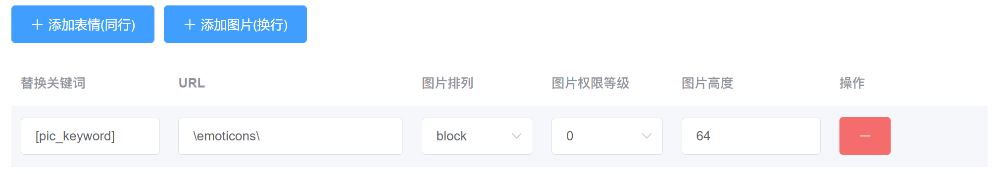 

#### `添加表情（同行）| 添加图片（换行） 按钮`
两者本质一致：2个按钮是为了快速添加2种表情图片
- 同行表情：
	- 图片排列——inline
	- 图片高度——建议和字体大小设置相近
- 换行图片：
	- 图片排列——block
	- 图片高度——建议设置为字体大小的3~4倍
#### `替换关键词` 
即弹幕关键词，弹幕中出现该关键词会触发表情包

#### `URL`
表情包的路径（存放文件夹+完整带后缀文件名）
例：图片名为【cry.png】时
```sh
\emoticons\cry.png
```
#### `图片排列`
- inline: 同行
- block: 换行 
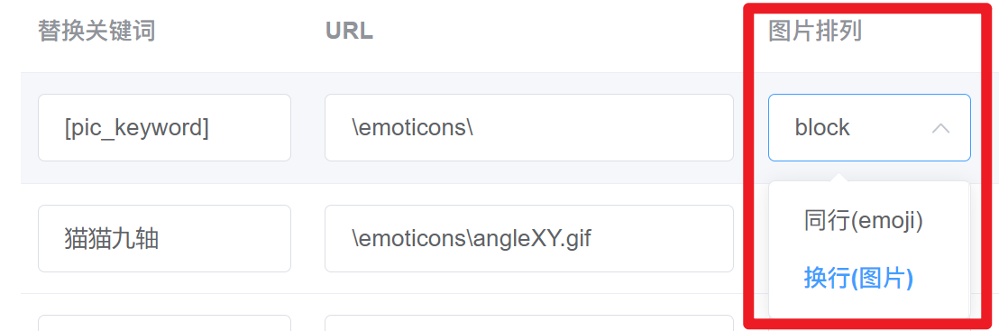

#### `图片权限等级`
- 0 = 【**所有人**】都能用的表情包
- 3 = 【**舰长**】以上包括舰长能用
- 2 = 【**提督**】以上包括提督能用
- 1 = 【**总督**】以上包括总督能用
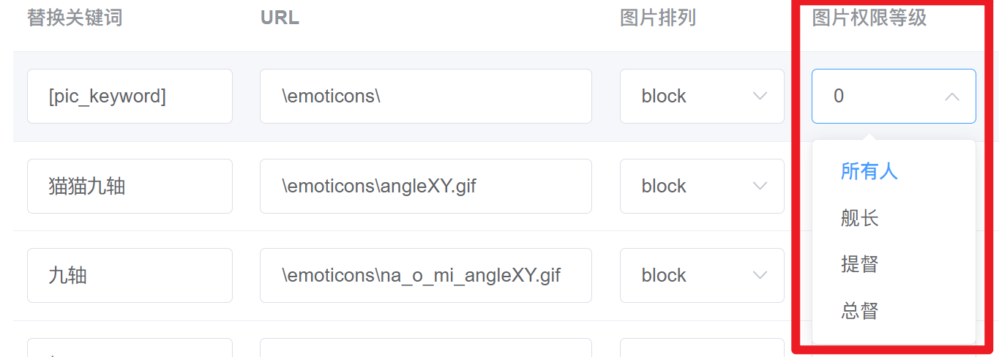
#### `图片高度`
图片的高度：inline(同行) 建议和字体大小设置相近，block(换行) 建议设置为字体大小的3~4倍

## **首页-样式生成器**——参数说明
### 1.粉丝牌子显示(适配样式生成器)

 

自定义
1. 是否显示粉丝勋章
2. 是否只显示直播主的直播间勋章
3. 是否显示勋章名
4. 是否显示勋章等级 

# [blivechat](https://github.com/xfgryujk/blivechat)(以下为原文档)
用于OBS的仿YouTube风格的bilibili直播评论栏

  
  
  

## 特性
* 兼容YouTube直播评论栏的样式
* 付费礼物模仿醒目留言显示
* 高亮舰队、房管、主播的用户名
* 支持屏蔽弹幕、合并相似弹幕等设置
* 自带两种样式生成器，经典YouTube风格和仿微信风格
* 支持前端直连B站服务器或者通过后端转发
* 支持自动翻译弹幕、醒目留言到日语，可以在后台配置翻译目标语言
* 支持标注打赏用户名的读音，可选拼音或日文假名
* 支持配置自定义表情，不需要开通B站官方表情

## 使用方法
以下几种方式任选一种即可

### 一、本地使用
1. 下载[发布版](https://github.com/xfgryujk/blivechat/releases)（仅提供x64 Windows版）
2. 双击`blivechat.exe`运行服务器，或者用命令行可以指定host和端口号：
    ```sh
    blivechat.exe --host 127.0.0.1 --port 12450
    ```
3. 用浏览器打开[http://localhost:12450](http://localhost:12450)，输入房间ID，复制房间URL
4. 用样式生成器生成样式，复制CSS
5. 在OBS中添加浏览器源，输入URL和自定义CSS

**注意事项：**

* 本地使用时不要关闭blivechat.exe那个黑框，否则不能继续获取头像或弹幕
* 样式生成器没有列出所有本地字体，但是可以手动输入本地字体
* 如果需要使用翻译功能，建议看[配置官方翻译接口傻瓜式教程](https://www.bilibili.com/read/cv14663633)

### 二、公共服务器
请优先在本地使用，使用公共服务器会有更大的延迟，而且服务器故障时可能发生直播事故

* [公共服务器](http://chat.bilisc.com/)

### 三、源代码版（自建服务器或在Windows以外平台）
0. 由于使用了git子模块，clone时需要加上`--recursive`参数：
    ```sh
    git clone --recursive https://github.com/xfgryujk/blivechat.git
    ```
    如果已经clone，拉子模块的方法：
    ```sh
    git submodule update --init --recursive
    ```
1. 编译前端（需要安装Node.js）：
    ```sh
    cd frontend
    npm i
    npm run build
    ```
2. 运行服务器（需要Python3.6以上版本）：
    ```sh
    pip3 install -r requirements.txt
    python3 main.py
    ```
    或者可以指定host和端口号：
    ```sh
    python3 main.py --host 127.0.0.1 --port 12450
    ```
3. 用浏览器打开[http://localhost:12450](http://localhost:12450)，以下略

### 四、Docker（自建服务器）
1.  ```sh
    docker run --name blivechat -d -p 12450:12450 \
      --mount source=blivechat-data,target=/mnt/data \
      xfgryujk/blivechat:latest
    ```
2. 用浏览器打开[http://localhost:12450](http://localhost:12450)，以下略

## 自建服务器相关补充
### 服务器配置
服务器配置在`data/config.ini`，可以配置数据库和允许自动翻译等，编辑后要重启生效

**自建服务器时强烈建议不使用加载器**，否则可能因为混合HTTP和HTTPS等原因加载不出来

### 参考nginx配置
`sudo vim /etc/nginx/sites-enabled/blivechat.conf`

```nginx
upstream blivechat {
	keepalive 8;
	# blivechat地址
	server 127.0.0.1:12450;
}

# 强制HTTPS
server {
	listen 80;
	listen [::]:80;
	server_name YOUR.DOMAIN.NAME;

	return 301 https://$server_name$request_uri;
}

server {
	listen 443 ssl;
	listen [::]:443 ssl;
	server_name YOUR.DOMAIN.NAME;

	# SSL
	ssl_certificate /PATH/TO/CERT.crt;
	ssl_certificate_key /PATH/TO/CERT_KEY.key;

	# 代理header
	proxy_http_version 1.1;
	proxy_set_header Host $host;
	proxy_set_header Connection "";
	proxy_set_header X-Real-IP $remote_addr;
	proxy_set_header X-Forwarded-For $proxy_add_x_forwarded_for;

	# 静态文件
	location / {
		root /PATH/TO/BLIVECHAT/frontend/dist;
		# 如果文件不存在，交给前端路由
		try_files $uri $uri/ /index.html;
	}
	location /emoticons {
		alias /PATH/TO/BLIVECHAT/data/emoticons;
	}
	# 动态API
	location /api {
		proxy_pass http://blivechat;
	}
	# websocket
	location = /api/chat {
		proxy_pass http://blivechat;

		# 代理websocket必须设置
		proxy_set_header Upgrade $http_upgrade;
		proxy_set_header Connection "Upgrade";

		# 由于这个块有proxy_set_header，这些不会自动继承
		proxy_set_header Host $host;
		proxy_set_header X-Real-IP $remote_addr;
		proxy_set_header X-Forwarded-For $proxy_add_x_forwarded_for;
	}
}
```
