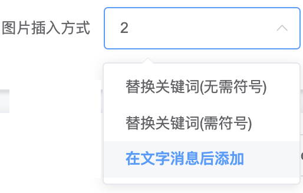
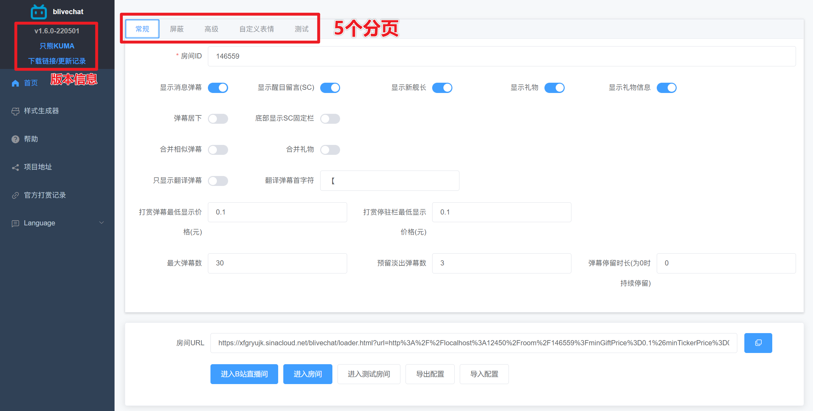
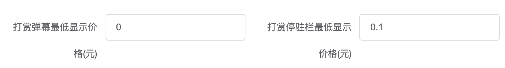
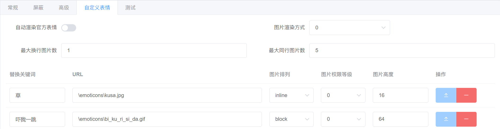
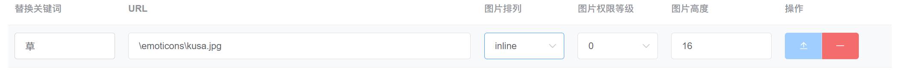
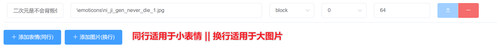
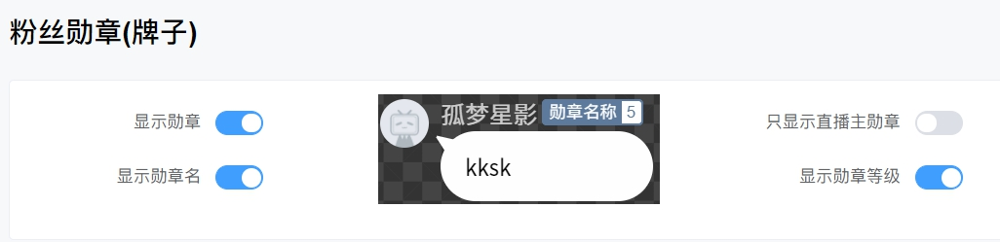

# 相比[原版blivechat](https://github.com/xfgryujk/blivechat)新增的功能

### 特别感谢（排名不分先后）：椅子_Official，海式policturn，小川尚未，梅林Kitsune，因扎因·内比娅, 玲玲
## 自定义弹幕触发图片(适配样式生成器)

 

### 表情包匹配逻辑
#### 1.贪婪匹配（匹配最长的字串）

 

#### 2.非贪婪匹配（匹配最短的字串）

 

### 表情包触发机制
 
#### 1.替换表情包（无需符号）
1. 检查弹幕内容里存在的表情包的关键词（且满足调用权限-如舰长身份）
2. 计算所有关键词在弹幕内容中的位置，并按顺序替换，直到达到 `最大同行图片数`，`最大换行图片数`

如：`钱` 是关键词，若最大图片数为2，则当出现`钱钱钱` 这样的弹幕时，会把前2个“钱”变为图片 `[图片]钱[图片]钱[文字]钱`

#### 2.在文字消息后添加
1. 检查弹幕内容里存在的表情包的关键词（且满足调用权限-如舰长身份）
2. 添加在弹幕消息后

如：`钱` 是关键词，若最大图片数为2，则当出现`钱钱钱` 这样的弹幕时，会把前两个钱变为图片 `[文字]钱[文字]钱[文字]钱[图片]钱`
## 其他自定义设置

 

### 1.自定义分别显示不同弹幕
 
1. 普通弹幕(Message)
2. 醒目留言(Super Chat)
3. 上舰信息(Member)
4. 礼物信息(Gift)
### 2.最低显示打赏价格（RMB/CNY/元）

 

1. 最低打赏价格（元） —— 弹幕区域的最低价格
2. 最低顶部停驻打赏价格（元） —— 顶部倒计时贴纸区域的最低价格

精确到小数点后1位，区分银瓜子，金瓜子礼物

- `银瓜子礼物`：价格为 `0元`
- `金瓜子礼物`：根据B站设定，最低为 `0.1元`

设置为 0.1, 则只显示金瓜子礼物, 不显示银瓜子礼物

### 3.自定义表情相关功能

 
#### `自动渲染官方表情` 
开启后：包含B站直播间通用表情，主播设置的B站表情（无需自己添加设定）——但缺点是不能自定义如图片换行/同行，图片高度（大小）

#### `图片插入方式` 
包含上文提到的2种
1. 替换关键词
2. 在文字之后添加

#### `最大换行图片数` 
即弹幕关键词转换为【换行】图片的最大数量（防止大量关键词出现时，图片刷屏）
默认为1，可填入非负整数，设置为0则屏蔽表情

#### `最大同行图片数` 
即弹幕关键词转换为【同行】图片的最大数量（防止大量关键词出现时，图片刷屏）
默认为5，可填入非负整数，设置为0则屏蔽表情

#### `自定义表情属性说明`

### 4. 表情包配置教程

#### 首先表情包需存放于： `/data/emoticon` 使用【**英文命名**】

 

在网页前端的【首页】-【自定义表情】处设置

 

 

#### `替换关键词` 
即弹幕关键词，弹幕中出现该关键词会触发表情包渲染

#### `URL`
表情包的路径（存放文件夹+完整带后缀文件名）
例：图片名为【cry.png】时
```sh
\emoticons\cry.png
```
#### `图片排列`
- inline: 同行
- block: 换行 

#### `图片权限等级`
- 0 = 【**所有人**】都能用的表情包
- 3 = 【**舰长**】以上包括舰长能用
- 2 = 【**提督**】以上包括提督能用
- 1 = 【**总督**】以上包括总督能用

#### `图片高度`
图片的高度，为非负整数

#### `添加表情（同行）| 添加图片（换行） 按钮`
两者本质一致：设定的URL都为图片的URL
2个按钮只是为了方便快速添加同行或换行图片
- inline 同行表情：默认为 16（建议和字体大小设置相近）
- block 换行图片：默认为 64
### 4.粉丝牌子显示(适配样式生成器)

 

自定义
1. 是否显示粉丝勋章
2. 是否只显示直播主的直播间勋章
3. 是否显示勋章名
4. 是否显示勋章等级 

### 5.单独显示翻译弹幕（开启后非翻译弹幕均不显示）

 

适用于有实时翻译man在直播间的V，可以单独分离以特定符号开头的弹幕（然而现在B站自动录播会带弹幕，直播间和录播都可以看到翻译弹幕）

# blivechat(以下为原文档)
用于OBS的仿YouTube风格的bilibili直播评论栏

  
  
  

## 特性
* 兼容YouTube直播评论栏的样式
* 付费礼物模仿醒目留言显示
* 高亮舰队、房管、主播的用户名
* 支持屏蔽弹幕、合并相似弹幕等设置
* 自带两种样式生成器，经典YouTube风格和仿微信风格
* 支持前端直连B站服务器或者通过后端转发
* 支持自动翻译弹幕、醒目留言到日语，可以在后台配置翻译目标语言
* 支持标注打赏用户名的读音，可选拼音或日文假名
* 支持配置自定义表情，不需要开通B站官方表情

## 使用方法
以下几种方式任选一种即可

### 一、本地使用
1. 下载[发布版](https://github.com/xfgryujk/blivechat/releases)（仅提供x64 Windows版）
2. 双击`blivechat.exe`运行服务器，或者用命令行可以指定host和端口号：
    ```sh
    blivechat.exe --host 127.0.0.1 --port 12450
    ```
3. 用浏览器打开[http://localhost:12450](http://localhost:12450)，输入房间ID，复制房间URL
4. 用样式生成器生成样式，复制CSS
5. 在OBS中添加浏览器源，输入URL和自定义CSS

**注意事项：**

* 本地使用时不要关闭blivechat.exe那个黑框，否则不能继续获取头像或弹幕
* 样式生成器没有列出所有本地字体，但是可以手动输入本地字体
* 如果需要使用翻译功能，建议看[配置官方翻译接口傻瓜式教程](https://www.bilibili.com/read/cv14663633)

### 二、公共服务器
请优先在本地使用，使用公共服务器会有更大的延迟，而且服务器故障时可能发生直播事故

* [公共服务器](http://chat.bilisc.com/)

### 三、源代码版（自建服务器或在Windows以外平台）
0. 由于使用了git子模块，clone时需要加上`--recursive`参数：
    ```sh
    git clone --recursive https://github.com/xfgryujk/blivechat.git
    ```
    如果已经clone，拉子模块的方法：
    ```sh
    git submodule update --init --recursive
    ```
1. 编译前端（需要安装Node.js）：
    ```sh
    cd frontend
    npm i
    npm run build
    ```
2. 运行服务器（需要Python3.6以上版本）：
    ```sh
    pip3 install -r requirements.txt
    python3 main.py
    ```
    或者可以指定host和端口号：
    ```sh
    python3 main.py --host 127.0.0.1 --port 12450
    ```
3. 用浏览器打开[http://localhost:12450](http://localhost:12450)，以下略

### 四、Docker（自建服务器）
1.  ```sh
    docker run --name blivechat -d -p 12450:12450 \
      --mount source=blivechat-data,target=/mnt/data \
      xfgryujk/blivechat:latest
    ```
2. 用浏览器打开[http://localhost:12450](http://localhost:12450)，以下略

## 自建服务器相关补充
### 服务器配置
服务器配置在`data/config.ini`，可以配置数据库和允许自动翻译等，编辑后要重启生效

**自建服务器时强烈建议不使用加载器**，否则可能因为混合HTTP和HTTPS等原因加载不出来

### 参考nginx配置
`sudo vim /etc/nginx/sites-enabled/blivechat.conf`

```nginx
upstream blivechat {
	keepalive 8;
	# blivechat地址
	server 127.0.0.1:12450;
}

# 强制HTTPS
server {
	listen 80;
	listen [::]:80;
	server_name YOUR.DOMAIN.NAME;

	return 301 https://$server_name$request_uri;
}

server {
	listen 443 ssl;
	listen [::]:443 ssl;
	server_name YOUR.DOMAIN.NAME;

	# SSL
	ssl_certificate /PATH/TO/CERT.crt;
	ssl_certificate_key /PATH/TO/CERT_KEY.key;

	# 代理header
	proxy_http_version 1.1;
	proxy_set_header Host $host;
	proxy_set_header Connection "";
	proxy_set_header X-Real-IP $remote_addr;
	proxy_set_header X-Forwarded-For $proxy_add_x_forwarded_for;

	# 静态文件
	location / {
		root /PATH/TO/BLIVECHAT/frontend/dist;
		# 如果文件不存在，交给前端路由
		try_files $uri $uri/ /index.html;
	}
	location /emoticons {
		alias /PATH/TO/BLIVECHAT/data/emoticons;
	}
	# 动态API
	location /api {
		proxy_pass http://blivechat;
	}
	# websocket
	location = /api/chat {
		proxy_pass http://blivechat;

		# 代理websocket必须设置
		proxy_set_header Upgrade $http_upgrade;
		proxy_set_header Connection "Upgrade";

		# 由于这个块有proxy_set_header，这些不会自动继承
		proxy_set_header Host $host;
		proxy_set_header X-Real-IP $remote_addr;
		proxy_set_header X-Forwarded-For $proxy_add_x_forwarded_for;
	}
}
```
